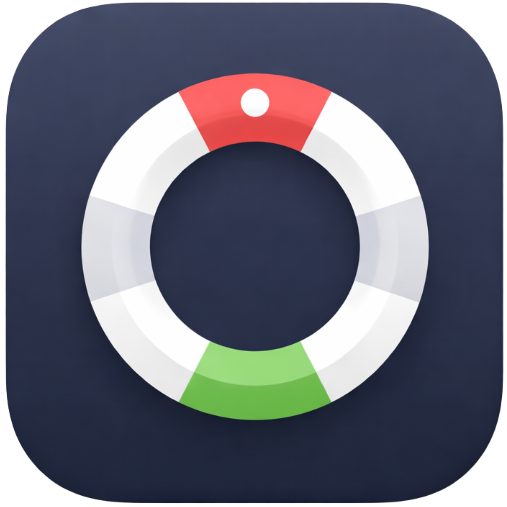

#  Buoy

> Keep a Mac awake on AC power, restore the original sleep settings cleanly, and inspect the machine from a native macOS dashboard.

`Buoy` is a macOS-only utility with two surfaces:

- `buoy`, a CLI that owns power-state changes and restore behavior
- `Buoy.app`, a native wrapper that drives the CLI and adds live system inspection

## What Buoy Does

- applies a server-friendly AC power profile with `pmset`
- keeps display sleep configurable instead of forcing the screen on
- optionally manages closed-lid awake behavior above a battery floor
- restores the previously saved AC settings with `buoy off`
- shows live Overview, Power, System, Processes, Services, Network, and Storage sections in the app
- scans storage in two passes: a fast summary refresh and an explicit deep scan for largest files

## What Buoy Does Not Do

- it does not manage non-macOS systems
- it does not auto-start at login or auto-apply on boot in the current repo
- it does not clean files automatically
- it does not replace `pmset`; it applies a narrow set of reversible settings on top of it

## Quick Start

Install from the latest GitHub release:

```bash
curl -fsSL https://raw.githubusercontent.com/WLKRLABS/buoy/main/install.sh | DOWNLOAD_REPO=WLKRLABS/buoy bash
```

Install from a local clone:

```bash
./install.sh
```

The installer:

- installs `buoy` to `~/.local/bin` by default
- installs `Buoy.app` to `~/Applications` by default
- prefers downloadable release assets when available
- falls back to a local source build when release assets are unavailable

If `~/.local/bin` is not already on your shell `PATH`, run:

```bash
buoy path-add
```

Then verify the install:

```bash
buoy doctor
buoy status
```

## Common Commands

```bash
buoy apply
buoy apply --display-sleep 5
buoy apply --clam --clam-min-battery 30 --clam-poll-seconds 15
buoy status
buoy status --json
buoy off
buoy screen-off
buoy doctor
```

## What `buoy apply` Changes

`buoy apply` reads the current AC profile, saves the original values, and applies a managed AC profile.

Managed keys:

- `sleep=0`
- `displaysleep=<minutes>`
- `standby=0`
- `powernap=0`
- `womp=1`
- `ttyskeepawake=1`
- `tcpkeepalive=1`

`buoy off` restores the saved AC values from `~/.buoy/state.json` and stops the closed-lid helper if it is running.

## Closed-Lid Awake Mode

When you pass `--clam`, Buoy also manages `SleepDisabled`.

Behavior:

- `SleepDisabled=1` on AC power
- `SleepDisabled=1` on battery above the configured threshold
- `SleepDisabled=0` at or below the threshold unless it was already enabled before Buoy

Example:

```bash
buoy apply --clam --clam-min-battery 30 --clam-poll-seconds 10
```

## App Overview

`Buoy.app` is not a separate control path. It drives the installed CLI and adds a native dashboard.

Power controls:

- Enable Buoy mode
- Allow closed-lid awake mode
- Display sleep
- Battery floor
- Poll interval
- Appearance
- Apply, Turn Off, Sleep Display, and Refresh

Dashboard sections:

- Overview
- Power
- System
- Processes
- Services
- Network
- Storage

Storage workflow highlights:

- cached snapshots for fast tab open
- background summary refreshes
- explicit `Deep Scan` for largest-file enumeration
- opt-in protected-folder grants for Desktop, Documents, Downloads, and Pictures
- saved bookmarks for extra folders and drives

Privileged writes use the standard macOS administrator prompt. Normal reads run through the CLI or local system APIs without extra elevation.

## Documentation

User docs:

- [Overview](docs/overview.md)
- [Getting Started](docs/getting-started.md)
- [Installation](docs/installation.md)
- [Interface Tour](docs/interface-tour.md)
- [Features](docs/features.md)
- [Metrics And Definitions](docs/metrics-and-definitions.md)
- [Alerts And Thresholds](docs/alerts-and-thresholds.md)
- [Settings Reference](docs/settings-reference.md)
- [Workflows](docs/workflows.md)
- [Troubleshooting](docs/troubleshooting.md)
- [FAQ](docs/faq.md)
- [Privacy And Permissions](docs/privacy-and-permissions.md)
- [Compatibility](docs/compatibility.md)
- [Accessibility](docs/accessibility.md)
- [Advanced Usage](docs/advanced-usage.md)

Developer docs:

- [Architecture](docs/developer/architecture.md)
- [Data Flow](docs/developer/data-flow.md)
- [Contributing](docs/developer/contributing.md)
- [Build And Run](docs/developer/build-and-run.md)
- [Testing](docs/developer/testing.md)
- [Release Process](docs/developer/release-process.md)

Machine-readable product docs:

- [Product Spec](docs/machine/product-spec.json)
- [Feature Map](docs/machine/feature-map.yaml)
- [Glossary](docs/machine/glossary.json)
- [Troubleshooting Map](docs/machine/troubleshooting-map.json)

Repo policy and history:

- [Changelog](CHANGELOG.md)
- [Versioning Policy](VERSIONING.md)
- [Root Contributing Notes](CONTRIBUTING.md)

Internal product notes that still exist in this repo:

- [Technical Roadmap](docs/technical-roadmap.md)
- [Brand System](docs/brand-system.md)
- [UX Foundation](docs/ux-foundation.md)
- [Writing Style](docs/writing-style.md)
- [Launch Risks](docs/launch-risks.md)
- [Architecture Decision Record](docs/adr/ADR-001-swift-cli-and-swift-wrapper.md)

## Build From Source

Build the CLI:

```bash
./scripts/build-cli.sh
```

Build the app:

```bash
./scripts/build-app.sh
```

Optional local signing for stable permissions across repeated local app installs:

```bash
./scripts/setup-local-signing.sh
./scripts/build-app.sh
```

Package release assets:

```bash
./scripts/package-release.sh
```

Validate versioning and render release notes:

```bash
bash scripts/validate-versioning.sh
./scripts/render-release-notes.sh
```

## Current Limits

- macOS only
- `Buoy.app` declares `LSMinimumSystemVersion` `13.0`
- privileged power changes still depend on standard macOS administrator authentication
- closed-lid awake mode uses a helper process
- source builds require a working Apple Swift toolchain
- current build scripts emit native binaries for the build host; universal build coverage is not documented in this repo
